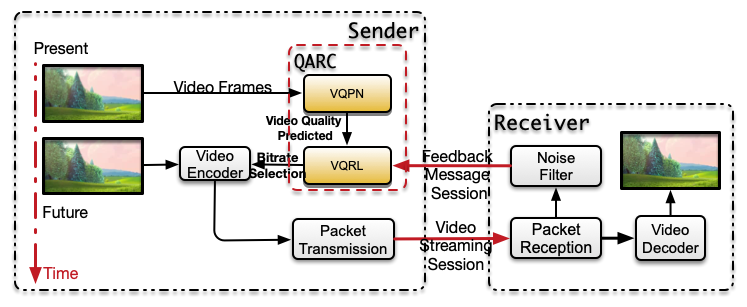

# QARC (video Quality Aware Rate Control)

## Introduction
Real-time video streaming is now one of the main applications in all network environments. Due to the fluctuation of throughput under various network conditions, how to choose a proper bitrate adaptively has become an upcoming and interesting issue. To tackle this problem, most proposed rate control methods work for providing high video bitrates instead of video qualities. Nevertheless, we notice that there exists a trade-off between sending bitrate and video quality, which motivates us to focus on how to reach a balance between them. We then propose QARC (video Quality Aware Rate Control), a rate control algorithm that aims to obtain a higher perceptual video quality with possible lower sending rate and transmission latency. In detail, QARC uses deep reinforcement learning(DRL) algorithm to train a neural network to select future bitrates based on previously observed network status and past video frames. To overcome the ``state explosion problem'', we design a neural network to predict future perceptual video quality as a vector for taking the place of the raw picture in the DRL's inputs. 

## Install Requirements
This work requires tensorflow, tflearn, scipy, matplotlib, opencv2 and tensorboard. Please install these package before using QARC.

## Video datasets
In 'videodatasets/', we describe how to generate video datasets.

1. Clone vmaf repo. for computing vmaf score: git clone https://github.com/Netflix/vmaf, then install it.
2. Copy the 'videodatasets' folder to the 'vmaf' folder.
3. Download several video clips into 'videodatasets/mov' folders, and the video MUST be encoded as h.264 format.
4. Run 'trans.py' for transcoding 'mp4' video format to 'flv'.
5. Run 'main.py' for generating video datasets including logs and video frames.
6. Type 'process-vmaf.py' to generate h5py file for training.

## QARC-basic
The traditional QARC method is composed of two modules: VQPN and VQRL.

### VQPN(Video Quality Prediction Network)
To run and evaluate VQPN, you should follow these steps.

1. Copy the '*.h5' training dataset and test dataset from 'videodatasets/' to 'QARC/VQPN'
   
2. There are two nerual network architecture candidates, GRU model (as shown in the paper) and CNN model (also reaches a high performance but a little bit lower than the GRU model performs), in different folders. Type 'cd gru/ & python main.py' for training GRU model or 'cd cnn/ & python main.py' for training CNN model. We use early stopping method that automaticlly tear down the training process if overfitting occurs.
   
3. We provide several baselines for evaluating the performance of VQPN in 'baseline/' folder.

### VQRL(Video Quality Reinforcement Learning)
To run and test VQRL, one should follow these steps:

1. Copy the pretrain VQPN model to 'QARC/VQRL/model/', we recommend GRU model for higher performances.
   
2. Collect network traces and copy the traces to 'QARC/VQRL/train_sim_traces/', the network traces' format is described like this: 'timestamp\tbandwidth\n', and you can also use cooked_traces from Pensieve as network trace dataset.
   
3. Run the training process via 'python main.py'

The usage of advanced-QARC is quite the same as QARC.
